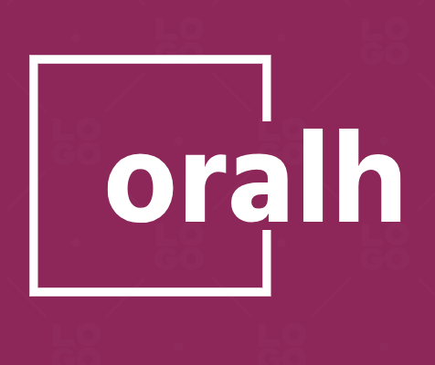

# OralH - An oral hygiene monitor app

  

This is an Oral Hygiene Application that uses TensorflowJS to load a disease detection model trained in tensorflow onto a PWA application. The trained model weights are first obtained as PyTorch file which is the  converted into an ONNX model following which it has been converted into a TFJS model.
The application can be hosted live temporarily using 'Ngrok' and can be used as an HTTPS website.
